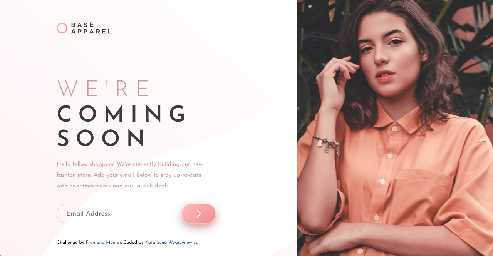

This project was bootstrapped with [Create React App](https://github.com/facebook/create-react-app).

# Frontend Mentor - Base Apparel coming soon page solution

This is a solution to the [Base Apparel coming soon page challenge on Frontend Mentor](https://www.frontendmentor.io/challenges/base-apparel-coming-soon-page-5d46b47f8db8a7063f9331a0).

## Table of contents

- [Overview](#overview)
  - [The challenge](#the-challenge)
  - [Screenshot](#screenshot)
  - [Links](#links)
- [My process](#my-process)
  - [Built with](#built-with)
  - [Useful resources](#useful-resources)
- [Author](#author)

## Overview

### The challenge

Users should be able to:

- View the optimal layout for the site depending on their device's screen size
- See hover states for all interactive elements on the page
- Receive an error message when the `form` is submitted if:
  - The `input` field is empty
  - The email address is not formatted correctly

### Screenshot

### Links

- Solution URL: [https://github.com/katarzyna-kw/landing-page-previewhttps://github.com/katarzyna-kw/landing-page-preview](https://github.com/katarzyna-kw/landing-page-preview)
- Live Site URL: [https://katarzyna-kw.github.io/landing-page-preview/](https://katarzyna-kw.github.io/landing-page-preview/)

## My process
This is a simple one page site. I choose to use React for this project because it provided the opportunity to practice using state and conditional rendering based on window size, as well as in validating a simple form without using a library. I enjoyed researching and problem-solving how to use React Hooks to responsively render different components based on the user changing the window size.

### Built with

- [React](https://reactjs.org/)
- CSS
- Flexbox
- Mobile-first workflow

### Useful resources

- [Simple Form Validation with React Hooks useState and useEffect](https://kitson-broadhurst.medium.com/simple-form-validation-with-react-hooks-usestate-and-useeffect-57620d808cc8) - This article was very helpful in understanding form validation with React Hooks, particularly with the concept of how/why to use useRef
- [Developing Responsive Layouts with React Hooks](https://blog.logrocket.com/developing-responsive-layouts-with-react-hooks/) - Great article about using React Hooks for responsive layouts

## Author

- Website - [Katarzyna Wegrzynowicz](https://katarzyna-kw.github.io/portfolio-website/)
- Frontend Mentor - [@katarzyna-kw](https://www.frontendmentor.io/profile/katarzyna-kw)
- Github - [@katarzyna-kw](https://github.com/katarzyna-kw)
